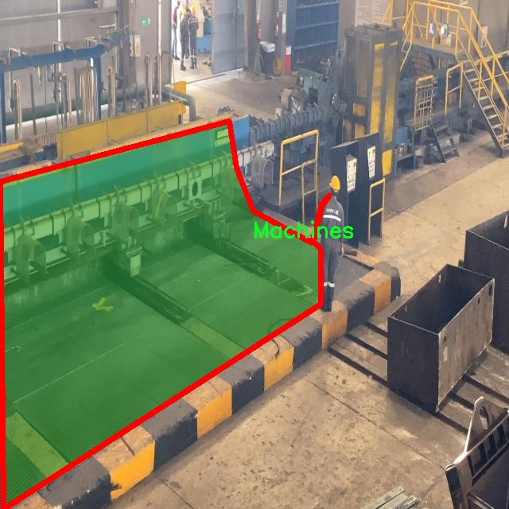

# 工厂危险工作区域监测设备图像分割系统源码＆数据集分享
 [yolov8-seg-C2f-DAttention＆yolov8-seg-repvit等50+全套改进创新点发刊_一键训练教程_Web前端展示]

### 1.研究背景与意义

项目参考[ILSVRC ImageNet Large Scale Visual Recognition Challenge](https://gitee.com/YOLOv8_YOLOv11_Segmentation_Studio/projects)

项目来源[AAAI Global Al lnnovation Contest](https://kdocs.cn/l/cszuIiCKVNis)

研究背景与意义

随着工业化进程的加快，工厂的生产效率和安全性成为了社会各界关注的焦点。尤其是在危险工作区域，工人面临着多种潜在的安全隐患，如机械设备的操作风险、化学品的泄漏以及高处作业的坠落等。因此，如何有效监测和管理这些危险区域，保障工人的安全，已成为亟待解决的重要课题。近年来，计算机视觉技术的快速发展为这一问题提供了新的解决方案，尤其是基于深度学习的图像分割技术，能够实现对工厂环境中各类物体的精准识别与定位。

在众多图像分割算法中，YOLO（You Only Look Once）系列模型因其高效的实时性和准确性而受到广泛关注。YOLOv8作为该系列的最新版本，进一步提升了目标检测和分割的性能，能够在复杂环境中快速、准确地识别出目标物体。然而，针对工厂危险工作区域的特定需求，YOLOv8的标准模型可能无法完全满足实际应用的要求。因此，基于YOLOv8的改进，开发一套专门针对工厂危险工作区域的图像分割系统，具有重要的理论价值和实际意义。

本研究所采用的数据集包含3400张图像，涵盖了8个类别，包括安全帽、机器、手套、无手套、无背心、人员、安全鞋和背心。这些类别的选择不仅反映了工厂工作环境中的常见物品，也突出了安全防护装备的重要性。通过对这些物体的精确分割与识别，能够有效监测工人在危险区域的安全状态，及时发现未佩戴安全装备的人员，从而降低事故发生的风险。此外，图像分割系统还可以为工厂管理者提供实时数据，帮助其优化安全管理措施，提升整体安全水平。

本研究的意义不仅在于技术上的创新，更在于其对工厂安全管理实践的推动。通过构建基于改进YOLOv8的图像分割系统，能够实现对工厂危险工作区域的智能监测，为工人提供更安全的工作环境。同时，该系统的成功应用也为其他行业的安全监测提供了借鉴，具有广泛的推广价值。

综上所述，基于改进YOLOv8的工厂危险工作区域监测设备图像分割系统的研究，不仅是对现有技术的提升，更是对工厂安全管理实践的有力支持。通过有效识别和监测危险工作区域的各类物体，能够显著降低工伤事故的发生率，保障工人的生命安全，推动工业生产的可持续发展。因此，本研究具有重要的理论意义和实践价值，为未来的安全管理提供了新的思路和方法。

### 2.图片演示


##### 注意：由于此博客编辑较早，上面“2.图片演示”和“3.视频演示”展示的系统图片或者视频可能为老版本，新版本在老版本的基础上升级如下：（实际效果以升级的新版本为准）

  （1）适配了YOLOV8的“目标检测”模型和“实例分割”模型，通过加载相应的权重（.pt）文件即可自适应加载模型。

  （2）支持“图片识别”、“视频识别”、“摄像头实时识别”三种识别模式。

  （3）支持“图片识别”、“视频识别”、“摄像头实时识别”三种识别结果保存导出，解决手动导出（容易卡顿出现爆内存）存在的问题，识别完自动保存结果并导出到tempDir中。

  （4）支持Web前端系统中的标题、背景图等自定义修改，后面提供修改教程。

  另外本项目提供训练的数据集和训练教程,暂不提供权重文件（best.pt）,需要您按照教程进行训练后实现图片演示和Web前端界面演示的效果。

### 3.视频演示

[3.1 视频演示](https://www.bilibili.com/video/BV11TmKYJENV/)

### 4.数据集信息展示

##### 4.1 本项目数据集详细数据（类别数＆类别名）

nc: 8
names: ['Helmet', 'Machines', 'gloves', 'no-gloves', 'no-vest', 'person', 'safety shoes', 'vest']


##### 4.2 本项目数据集信息介绍

数据集信息展示

在本研究中，我们使用了名为“Instance_segmention_msn3”的数据集，以支持改进YOLOv8-seg的工厂危险工作区域监测设备图像分割系统的训练和评估。该数据集专门设计用于识别和分割工厂环境中的各种安全装备和人员，以提高工作场所的安全性和效率。数据集包含8个类别，分别是：头盔（Helmet）、机器（Machines）、手套（gloves）、无手套（no-gloves）、无背心（no-vest）、人员（person）、安全鞋（safety shoes）和背心（vest）。这些类别涵盖了工厂工作环境中常见的安全防护装备及其相关对象，旨在帮助监测系统准确识别潜在的安全隐患。

在数据集的构建过程中，特别关注了工厂环境的多样性和复杂性。每个类别的图像都经过精心挑选，以确保在不同的光照条件、角度和背景下都能有效进行分割和识别。例如，头盔和背心的图像可能在不同的颜色和样式上有所变化，而机器的图像则可能包括多种类型的设备。这种多样性不仅增强了模型的鲁棒性，也使得系统在实际应用中能够更好地适应各种工厂环境。

数据集中的每个图像都附带了详细的标注信息，标注不仅包括对象的类别，还涵盖了对象的精确位置和轮廓。这种高质量的标注为YOLOv8-seg模型的训练提供了丰富的监督信号，使得模型能够学习到不同类别对象的特征和分布，从而在实际应用中实现高效的图像分割。通过对图像中每个对象的精确分割，系统能够实时监测工厂内的安全装备佩戴情况，及时发现未佩戴安全装备的人员，进而降低事故发生的风险。

此外，数据集的构建还考虑到了数据的平衡性。每个类别的样本数量经过精心设计，以避免在训练过程中出现类别不平衡的问题。通过确保每个类别都有足够的样本，模型能够在学习过程中获得更全面的特征，从而提高其在实际应用中的识别准确率。

在进行模型训练时，我们采用了数据增强技术，以进一步提升模型的泛化能力。通过对图像进行旋转、缩放、裁剪和颜色变换等操作，生成多样化的训练样本，增强模型对不同场景和条件的适应能力。这种策略不仅提高了模型的鲁棒性，还能有效防止过拟合现象的发生。

综上所述，“Instance_segmention_msn3”数据集为改进YOLOv8-seg的工厂危险工作区域监测设备图像分割系统提供了坚实的基础。通过丰富的类别信息和高质量的标注，结合有效的数据增强策略，期望该系统能够在实际应用中发挥重要作用，为工厂安全管理提供有力支持。




### 5.全套项目环境部署视频教程（零基础手把手教学）

[5.1 环境部署教程链接（零基础手把手教学）](https://www.bilibili.com/video/BV1jG4Ve4E9t/?vd_source=bc9aec86d164b67a7004b996143742dc)


[5.2 安装Python虚拟环境创建和依赖库安装视频教程链接（零基础手把手教学）](https://www.bilibili.com/video/BV1nA4VeYEze/?vd_source=bc9aec86d164b67a7004b996143742dc)

### 6.手把手YOLOV8-seg训练视频教程（零基础小白有手就能学会）

[6.1 手把手YOLOV8-seg训练视频教程（零基础小白有手就能学会）](https://www.bilibili.com/video/BV1cA4VeYETe/?vd_source=bc9aec86d164b67a7004b996143742dc)


按照上面的训练视频教程链接加载项目提供的数据集，运行train.py即可开始训练



     Epoch   gpu_mem       box       obj       cls    labels  img_size
     1/200     0G   0.01576   0.01955  0.007536        22      1280: 100%|██████████| 849/849 [14:42<00:00,  1.04s/it]
               Class     Images     Labels          P          R     mAP@.5 mAP@.5:.95: 100%|██████████| 213/213 [01:14<00:00,  2.87it/s]
                 all       3395      17314      0.994      0.957      0.0957      0.0843

     Epoch   gpu_mem       box       obj       cls    labels  img_size
     2/200     0G   0.01578   0.01923  0.007006        22      1280: 100%|██████████| 849/849 [14:44<00:00,  1.04s/it]
               Class     Images     Labels          P          R     mAP@.5 mAP@.5:.95: 100%|██████████| 213/213 [01:12<00:00,  2.95it/s]
                 all       3395      17314      0.996      0.956      0.0957      0.0845

     Epoch   gpu_mem       box       obj       cls    labels  img_size
     3/200     0G   0.01561    0.0191  0.006895        27      1280: 100%|██████████| 849/849 [10:56<00:00,  1.29it/s]
               Class     Images     Labels          P          R     mAP@.5 mAP@.5:.95: 100%|███████   | 187/213 [00:52<00:00,  4.04it/s]
                 all       3395      17314      0.996      0.957      0.0957      0.0845


### 7.50+种全套YOLOV8-seg创新点代码加载调参视频教程（一键加载写好的改进模型的配置文件）

[7.1 50+种全套YOLOV8-seg创新点代码加载调参视频教程（一键加载写好的改进模型的配置文件）](https://www.bilibili.com/video/BV1Hw4VePEXv/?vd_source=bc9aec86d164b67a7004b996143742dc)

### 8.YOLOV8-seg图像分割算法原理

原始YOLOv8-seg算法原理

YOLOv8-seg算法是2023年由Ultralytics推出的一款先进的目标检测与分割模型，它在YOLO系列的基础上进行了多项创新与优化，结合了YOLOv5、YOLOv6、YOLOv7以及PP-YOLOE等多种算法的优点，标志着目标检测领域的一次重要进步。YOLOv8-seg不仅继承了YOLO系列一贯的高效性和实时性，还在精度和功能上实现了显著提升，尤其是在图像分割任务中的表现，展现了其在复杂场景下的强大能力。

YOLOv8-seg的核心思想是将目标检测与实例分割相结合，通过单一的神经网络模型实现对目标的定位、分类以及精确的边界分割。这一创新使得YOLOv8-seg在处理多种目标时，能够同时输出目标的类别、位置和分割掩码，极大地提升了模型的实用性和灵活性。YOLOv8-seg的网络结构主要由主干网络、特征增强网络和检测头组成，采用了现代深度学习中的多种先进技术。

在主干网络方面，YOLOv8-seg依然延续了CSP（Cross Stage Partial）网络的设计理念，旨在通过分阶段的特征提取来提高网络的学习能力和计算效率。CSP结构通过将特征图分为多个部分并进行交叉连接，有效地减少了模型的参数量，同时保持了较高的特征表达能力。这种设计不仅加快了模型的训练速度，还增强了模型对不同特征的提取能力，使得YOLOv8-seg在处理复杂场景时表现得更加出色。

特征增强网络则采用了PAN-FPN（Path Aggregation Network - Feature Pyramid Network）的结合，旨在实现多尺度特征的高效融合。PAN-FPN通过引入路径聚合的思想，增强了不同层次特征之间的信息流动，确保了高层特征与低层特征的有效结合。这一设计使得YOLOv8-seg能够更好地捕捉到不同尺度目标的特征信息，从而在目标检测和分割任务中实现更高的精度。

在检测头部分，YOLOv8-seg采用了解耦头的设计，将目标的分类和回归任务分为两个独立的分支。这一创新的解耦策略使得模型在处理复杂场景时，能够更加专注于各自的任务，显著降低了定位不准和分类错误的风险。同时，YOLOv8-seg引入了Anchor-free目标检测方法，直接通过回归的方式预测目标的位置和大小，省去了传统方法中繁琐的锚点框定义与调整过程。这种简化不仅提高了模型的训练效率，也使得YOLOv8-seg在不同尺度和形状的目标检测中表现得更加灵活和高效。

YOLOv8-seg的损失函数设计也经过了精心优化，结合了多种损失策略以提高模型的训练效果。特别是在分割任务中，YOLOv8-seg采用了交叉熵损失与Dice损失的结合，确保了模型在边界处理和目标分割上的高精度。这种多损失策略使得模型在面对复杂背景和多目标场景时，能够更好地进行目标分割，减少了漏检和误检的情况。

此外，YOLOv8-seg在轻量化设计方面也做出了显著努力。通过对网络结构的优化，YOLOv8-seg的权重文件相比于之前的YOLO系列进一步减小，使得模型能够在各种嵌入式设备上高效运行。这一特性使得YOLOv8-seg不仅适用于传统的计算平台，也能够在移动设备和边缘计算环境中实现实时目标检测与分割，极大地拓宽了其应用场景。

在实际应用中，YOLOv8-seg的表现令人瞩目。以苹果采摘为例，利用YOLOv8-seg的视觉识别能力，自动检测和定位苹果，不仅提高了采摘效率，还降低了人工成本。同时，结合蚁群算法进行路径规划，进一步优化了采摘机器人的工作流程，使得整个过程更加智能化和自动化。这一应用展示了YOLOv8-seg在农业领域的潜力，预示着未来在更多行业中的广泛应用。

综上所述，YOLOv8-seg算法以其高效、精确的特性，结合了现代深度学习的多项创新，成为目标检测与分割领域的一颗新星。它不仅提升了目标检测的实时性和准确性，更为未来的智能应用奠定了坚实的基础。随着技术的不断进步，YOLOv8-seg有望在更多复杂场景中展现出其卓越的性能，推动目标检测与分割技术的进一步发展。


### 9.系统功能展示（检测对象为举例，实际内容以本项目数据集为准）

图9.1.系统支持检测结果表格显示

  图9.2.系统支持置信度和IOU阈值手动调节

  图9.3.系统支持自定义加载权重文件best.pt(需要你通过步骤5中训练获得)

  图9.4.系统支持摄像头实时识别

  图9.5.系统支持图片识别

  图9.6.系统支持视频识别

  图9.7.系统支持识别结果文件自动保存

  图9.8.系统支持Excel导出检测结果数据


### 10.50+种全套YOLOV8-seg创新点原理讲解（非科班也可以轻松写刊发刊，V11版本正在科研待更新）

#### 10.1 由于篇幅限制，每个创新点的具体原理讲解就不一一展开，具体见下列网址中的创新点对应子项目的技术原理博客网址【Blog】：


[10.1 50+种全套YOLOV8-seg创新点原理讲解链接](https://gitee.com/qunmasj/good)

#### 10.2 部分改进模块原理讲解(完整的改进原理见上图和技术博客链接)【如果此小节的图加载失败可以通过CSDN或者Github搜索该博客的标题访问原始博客，原始博客图片显示正常】
### YOLOv8算法原理
YOLOv8算法由Glenn-Jocher 提出，是跟YOLOv3算法、YOLOv5算法一脉相承的，主要的改进点如下:
(1)数据预处理。YOLOv8的数据预处理依旧采用YOLOv5的策略,在训练时，主要采用包括马赛克增强(Mosaic)、混合增强(Mixup)、空间扰动(randomperspective)以及颜色扰动(HSV augment)四个增强手段。
(2)骨干网络结构。YOLOv8的骨干网络结构可从YOLOv5略见一斑，YOLOv5的主干网络的架构规律十分清晰，总体来看就是每用一层步长为2的3×3卷积去降采样特征图，接一个C3模块来进一步强化其中的特征，且C3的基本深度参数分别为“3/6/9/3”，其会根据不同规模的模型的来做相应的缩放。在的YOLOv8中，大体上也还是继承了这一特点，原先的C3模块均被替换成了新的C2f模块，C2f 模块加入更多的分支，丰富梯度回传时的支流。下面展示了YOLOv8的C2f模块和YOLOv5的C3模块，其网络结构图所示。


(3)FPN-PAN结构。YOLOv8仍采用FPN+PAN结构来构建YOLO的特征金字塔，使多尺度信息之间进行充分的融合。除了FPN-PAN里面的C3模块被替换为C2f模块外，其余部分与YOLOv5的FPN-PAN结构基本一致。
(4)Detection head结构。从 YOLOv3到 YOLOv5，其检测头一直都是“耦合”(Coupled)的,即使用一层卷积同时完成分类和定位两个任务，直到YOLOX的问世， YOLO系列才第一次换装“解耦头”(Decoupled Head)。YOLOv8也同样也采用了解耦头的结构，两条并行的分支分别取提取类别特征和位置特征，然后各用一层1x1卷积完成分类和定位任务。YOLOv8整体的网络结构由图所示。


(5)标签分配策略。尽管YOLOv5设计了自动聚类候选框的一些功能，但是聚类候选框是依赖于数据集的。若数据集不够充分，无法较为准确地反映数据本身的分布特征，聚类出来的候选框也会与真实物体尺寸比例悬殊过大。YOLOv8没有采用候选框策略，所以解决的问题就是正负样本匹配的多尺度分配。不同于YOLOX所使用的 SimOTA，YOLOv8在标签分配问题上采用了和YOLOv6相同的TOOD策略，是一种动态标签分配策略。YOLOv8只用到了targetboze。和target scores，未含是否有物体预测，故 YOLOv8的损失就主要包括两大部分∶类别损失和位置损失。对于YOLOv8，其分类损失为VFLLoss(Varifocal Loss)，其回归损失为CIoU Loss 与 DFL Loss 的形式。
其中 Varifocal Loss定义如下:


其中p为预测的类别得分，p ∈ [0.1]。q为预测的目标分数(若为真实类别，则q为预测和真值的 loU;若为其他类别。q为0 )。VFL Loss使用不对称参数来对正负样本进行加权，通过只对负样本进行衰减，达到不对等的处理前景和背景对损失的贡献。对正样本，使用q进行了加权，如果正样本的GTiou很高时,则对损失的贡献更大一些，可以让网络聚焦于那些高质量的样本上，即训练高质量的正例对AP的提升比低质量的更大一些。对负样本，使用p进行了降权，降低了负例对损失的贡献，因负样本的预测p在取次幂后会变得更小，这样就能够降低负样本对损失的整体贡献。

### 动态蛇形卷积Dynamic Snake Convolution

参考论文： 2307.08388.pdf (arxiv.org)

血管、道路等拓扑管状结构的精确分割在各个领域都至关重要，确保下游任务的准确性和效率。 然而，许多因素使任务变得复杂，包括薄的局部结构和可变的全局形态。在这项工作中，我们注意到管状结构的特殊性，并利用这些知识来指导我们的 DSCNet 在三个阶段同时增强感知：特征提取、特征融合、 和损失约束。 首先，我们提出了一种动态蛇卷积，通过自适应地关注细长和曲折的局部结构来准确捕获管状结构的特征。 随后，我们提出了一种多视图特征融合策略，以补充特征融合过程中多角度对特征的关注，确保保留来自不同全局形态的重要信息。 最后，提出了一种基于持久同源性的连续性约束损失函数，以更好地约束分割的拓扑连续性。 2D 和 3D 数据集上的实验表明，与多种方法相比，我们的 DSCNet 在管状结构分割任务上提供了更好的准确性和连续性。 我们的代码是公开的。 
主要的挑战源于细长微弱的局部结构特征与复杂多变的全局形态特征。本文关注到管状结构细长连续的特点，并利用这一信息在神经网络以下三个阶段同时增强感知：特征提取、特征融合和损失约束。分别设计了动态蛇形卷积（Dynamic Snake Convolution），多视角特征融合策略与连续性拓扑约束损失。 

我们希望卷积核一方面能够自由地贴合结构学习特征，另一方面能够在约束条件下不偏离目标结构太远。在观察管状结构的细长连续的特征后，脑海里想到了一个动物——蛇。我们希望卷积核能够像蛇一样动态地扭动，来贴合目标的结构。

我们希望卷积核一方面能够自由地贴合结构学习特征，另一方面能够在约束条件下不偏离目标结构太远。在观察管状结构的细长连续的特征后，脑海里想到了一个动物——蛇。我们希望卷积核能够像蛇一样动态地扭动，来贴合目标的结构。


### DCNV2融入YOLOv8
DCN和DCNv2（可变性卷积）
网上关于两篇文章的详细描述已经很多了，我这里具体的细节就不多讲了，只说一下其中实现起来比较困惑的点。（黑体字会讲解）

DCNv1解决的问题就是我们常规的图像增强，仿射变换（线性变换加平移）不能解决的多种形式目标变换的几何变换的问题。如下图所示。

可变性卷积的思想很简单，就是讲原来固定形状的卷积核变成可变的。如下图所示：


首先来看普通卷积，以3x3卷积为例对于每个输出y(p0)，都要从x上采样9个位置，这9个位置都在中心位置x(p0)向四周扩散得到的gird形状上，(-1,-1)代表x(p0)的左上角，(1,1)代表x(p0)的右下角，其他类似。

用公式表示如下：


可变性卷积Deformable Conv操作并没有改变卷积的计算操作，而是在卷积操作的作用区域上，加入了一个可学习的参数∆pn。同样对于每个输出y(p0)，都要从x上采样9个位置，这9个位置是中心位置x(p0)向四周扩散得到的，但是多了 ∆pn，允许采样点扩散成非gird形状。


偏移量是通过对原始特征层进行卷积得到的。比如输入特征层是w×h×c，先对输入的特征层进行卷积操作，得到w×h×2c的offset field。这里的w和h和原始特征层的w和h是一致的，offset field里面的值是输入特征层对应位置的偏移量，偏移量有x和y两个方向，所以offset field的channel数是2c。offset field里的偏移量是卷积得到的，可能是浮点数，所以接下来需要通过双向性插值计算偏移位置的特征值。在偏移量的学习中，梯度是通过双线性插值来进行反向传播的。
看到这里是不是还是有点迷茫呢？那到底程序上面怎么实现呢？


事实上由上面的公式我们可以看得出来∆pn这个偏移量是加在原像素点上的，但是我们怎么样从代码上对原像素点加这个量呢？其实很简单，就是用一个普通的卷积核去跟输入图片（一般是输入的feature_map）卷积就可以了卷积核的数量是2N也就是23*3==18（前9个通道是x方向的偏移量，后9个是y方向的偏移量），然后把这个卷积的结果与正常卷积的结果进行相加就可以了。
然后又有了第二个问题，怎么样反向传播呢？为什么会有这个问题呢？因为求出来的偏移量+正常卷积输出的结果往往是一个浮点数，浮点数是无法对应到原图的像素点的，所以自然就想到了双线性差值的方法求出浮点数对应的浮点像素点。


#### DCN v2
对于positive的样本来说，采样的特征应该focus在RoI内，如果特征中包含了过多超出RoI的内容，那么结果会受到影响和干扰。而negative样本则恰恰相反，引入一些超出RoI的特征有助于帮助网络判别这个区域是背景区域。

DCNv1引入了可变形卷积，能更好的适应目标的几何变换。但是v1可视化结果显示其感受野对应位置超出了目标范围，导致特征不受图像内容影响（理想情况是所有的对应位置分布在目标范围以内）。

为了解决该问题：提出v2, 主要有

1、扩展可变形卷积，增强建模能力
2、提出了特征模拟方案指导网络培训：feature mimicking scheme

上面这段话是什么意思呢，通俗来讲就是，我们的可变性卷积的区域大于目标所在区域，所以这时候就会对非目标区域进行错误识别。

所以自然能想到的解决方案就是加入权重项进行惩罚。（至于这个实现起来就比较简单了，直接初始化一个权重然后乘(input+offsets)就可以了）


可调节的RoIpooling也是类似的，公式如下：


### 11.项目核心源码讲解（再也不用担心看不懂代码逻辑）

#### 11.1 ui.py

以下是对给定代码的核心部分进行保留和详细注释的版本：

```python
import sys
import subprocess

def run_script(script_path):
    """
    使用当前 Python 环境运行指定的脚本。

    Args:
        script_path (str): 要运行的脚本路径

    Returns:
        None
    """
    # 获取当前 Python 解释器的路径
    python_path = sys.executable

    # 构建运行命令，使用 streamlit 运行指定的脚本
    command = f'"{python_path}" -m streamlit run "{script_path}"'

    # 执行命令并等待其完成
    result = subprocess.run(command, shell=True)
    
    # 检查命令执行的返回码，0 表示成功，非0表示出错
    if result.returncode != 0:
        print("脚本运行出错。")

# 实例化并运行应用
if __name__ == "__main__":
    # 指定要运行的脚本路径
    script_path = "web.py"  # 这里可以直接使用相对路径

    # 调用函数运行脚本
    run_script(script_path)
```

### 代码分析与注释：
1. **导入模块**：
   - `sys`：用于访问与 Python 解释器相关的变量和函数。
   - `subprocess`：用于执行外部命令。

2. **`run_script` 函数**：
   - **参数**：接收一个字符串参数 `script_path`，表示要运行的 Python 脚本的路径。
   - **功能**：构建并执行一个命令来运行指定的脚本。

3. **获取 Python 解释器路径**：
   - `sys.executable` 返回当前 Python 解释器的完整路径。

4. **构建命令**：
   - 使用 f-string 构建一个命令字符串，调用 `streamlit` 来运行指定的脚本。

5. **执行命令**：
   - `subprocess.run` 方法用于执行构建的命令，`shell=True` 表示在 shell 中执行。

6. **检查返回码**：
   - `result.returncode` 用于检查命令的执行结果，0 表示成功，非0表示出错，若出错则打印错误信息。

7. **主程序块**：
   - 使用 `if __name__ == "__main__":` 确保该代码块仅在脚本作为主程序运行时执行。
   - 指定要运行的脚本路径，并调用 `run_script` 函数执行该脚本。

通过以上注释，代码的核心逻辑和功能得以清晰呈现。

这个程序文件名为 `ui.py`，其主要功能是运行一个指定的 Python 脚本，具体来说是通过 Streamlit 框架来启动一个 Web 应用。

首先，文件导入了几个必要的模块，包括 `sys`、`os` 和 `subprocess`。其中，`sys` 模块用于访问与 Python 解释器相关的变量和函数，`os` 模块提供了与操作系统交互的功能，而 `subprocess` 模块则用于执行外部命令。

接着，文件从 `QtFusion.path` 模块中导入了 `abs_path` 函数，这个函数的作用是获取文件的绝对路径。

在 `run_script` 函数中，首先定义了一个参数 `script_path`，它表示要运行的脚本的路径。函数内部通过 `sys.executable` 获取当前 Python 解释器的路径，然后构建一个命令字符串，该命令用于运行指定的脚本。命令的格式是使用当前 Python 环境下的 Streamlit 模块来运行脚本。

接下来，使用 `subprocess.run` 方法执行构建好的命令。如果命令执行后返回的状态码不为 0，表示脚本运行过程中出现了错误，程序会打印出“脚本运行出错”的提示信息。

在文件的最后部分，使用 `if __name__ == "__main__":` 语句来判断该文件是否是被直接运行的。如果是，则指定要运行的脚本路径，这里是通过 `abs_path` 函数获取的 `web.py` 的绝对路径。最后，调用 `run_script` 函数来执行这个脚本。

总体来说，这个程序的主要功能是提供一个简单的接口来运行一个 Streamlit 应用，方便用户通过命令行启动 Web 应用。

#### 11.2 ultralytics\nn\backbone\convnextv2.py

以下是提取后的核心代码部分，并附上详细的中文注释：

```python
import torch
import torch.nn as nn
import torch.nn.functional as F

class LayerNorm(nn.Module):
    """ 自定义的LayerNorm层，支持两种数据格式：channels_last（默认）和channels_first。
    channels_last对应的输入形状为(batch_size, height, width, channels)，
    而channels_first对应的输入形状为(batch_size, channels, height, width)。
    """
    def __init__(self, normalized_shape, eps=1e-6, data_format="channels_last"):
        super().__init__()
        # 权重和偏置参数
        self.weight = nn.Parameter(torch.ones(normalized_shape))
        self.bias = nn.Parameter(torch.zeros(normalized_shape))
        self.eps = eps
        self.data_format = data_format
        if self.data_format not in ["channels_last", "channels_first"]:
            raise NotImplementedError 
        self.normalized_shape = (normalized_shape, )
    
    def forward(self, x):
        # 根据数据格式进行归一化
        if self.data_format == "channels_last":
            return F.layer_norm(x, self.normalized_shape, self.weight, self.bias, self.eps)
        elif self.data_format == "channels_first":
            u = x.mean(1, keepdim=True)  # 计算均值
            s = (x - u).pow(2).mean(1, keepdim=True)  # 计算方差
            x = (x - u) / torch.sqrt(s + self.eps)  # 标准化
            x = self.weight[:, None, None] * x + self.bias[:, None, None]  # 应用权重和偏置
            return x

class Block(nn.Module):
    """ ConvNeXtV2的基本块，包含深度可分离卷积、归一化、激活等操作。
    
    Args:
        dim (int): 输入通道数。
    """
    def __init__(self, dim):
        super().__init__()
        self.dwconv = nn.Conv2d(dim, dim, kernel_size=7, padding=3, groups=dim)  # 深度卷积
        self.norm = LayerNorm(dim, eps=1e-6)  # 归一化层
        self.pwconv1 = nn.Linear(dim, 4 * dim)  # 1x1卷积（用线性层实现）
        self.act = nn.GELU()  # 激活函数
        self.pwconv2 = nn.Linear(4 * dim, dim)  # 1x1卷积（用线性层实现）

    def forward(self, x):
        input = x  # 保存输入以便后续残差连接
        x = self.dwconv(x)  # 深度卷积
        x = x.permute(0, 2, 3, 1)  # 转换维度顺序
        x = self.norm(x)  # 归一化
        x = self.pwconv1(x)  # 第一个1x1卷积
        x = self.act(x)  # 激活
        x = self.pwconv2(x)  # 第二个1x1卷积
        x = x.permute(0, 3, 1, 2)  # 恢复维度顺序

        x = input + x  # 残差连接
        return x

class ConvNeXtV2(nn.Module):
    """ ConvNeXt V2模型定义。
    
    Args:
        in_chans (int): 输入图像的通道数。默认值为3。
        num_classes (int): 分类头的类别数。默认值为1000。
        depths (tuple(int)): 每个阶段的块数。默认值为[3, 3, 9, 3]。
        dims (int): 每个阶段的特征维度。默认值为[96, 192, 384, 768]。
    """
    def __init__(self, in_chans=3, num_classes=1000, 
                 depths=[3, 3, 9, 3], dims=[96, 192, 384, 768]):
        super().__init__()
        self.downsample_layers = nn.ModuleList()  # 下采样层列表
        # 定义stem层
        stem = nn.Sequential(
            nn.Conv2d(in_chans, dims[0], kernel_size=4, stride=4),
            LayerNorm(dims[0], eps=1e-6, data_format="channels_first")
        )
        self.downsample_layers.append(stem)
        # 定义下采样层
        for i in range(3):
            downsample_layer = nn.Sequential(
                LayerNorm(dims[i], eps=1e-6, data_format="channels_first"),
                nn.Conv2d(dims[i], dims[i+1], kernel_size=2, stride=2),
            )
            self.downsample_layers.append(downsample_layer)

        self.stages = nn.ModuleList()  # 特征分辨率阶段列表
        for i in range(4):
            stage = nn.Sequential(
                *[Block(dim=dims[i]) for _ in range(depths[i])]  # 添加多个Block
            )
            self.stages.append(stage)

        self.norm = nn.LayerNorm(dims[-1], eps=1e-6)  # 最后的归一化层
        self.head = nn.Linear(dims[-1], num_classes)  # 分类头

    def forward(self, x):
        res = []  # 存储每个阶段的输出
        for i in range(4):
            x = self.downsample_layers[i](x)  # 下采样
            x = self.stages[i](x)  # 通过当前阶段
            res.append(x)  # 保存输出
        return res  # 返回所有阶段的输出
```

### 代码核心部分说明：
1. **LayerNorm**: 自定义的层归一化实现，支持不同的数据格式，确保模型在训练时的稳定性。
2. **Block**: ConvNeXtV2的基本构建块，使用深度卷积和1x1卷积进行特征提取，并实现残差连接。
3. **ConvNeXtV2**: 主模型类，定义了模型的整体结构，包括下采样层和多个特征提取阶段，最后通过分类头输出结果。

这个程序文件定义了一个名为 `ConvNeXtV2` 的深度学习模型，主要用于图像分类任务。它的结构和功能可以分为几个主要部分。

首先，文件中引入了一些必要的库，包括 PyTorch 和 NumPy。接着，定义了几个类，分别实现了不同的功能。

`LayerNorm` 类实现了层归一化，支持两种数据格式：`channels_last` 和 `channels_first`。在前向传播中，根据输入数据的格式，选择合适的归一化方法。

`GRN` 类实现了全局响应归一化层，通过计算输入的 L2 范数来进行归一化，并引入了可学习的参数 `gamma` 和 `beta`，以便在训练过程中调整输出。

`Block` 类是 ConvNeXtV2 的基本构建块，包含深度可分离卷积、层归一化、点卷积、激活函数（GELU）和 GRN。它的前向传播过程包括对输入进行卷积、归一化、激活和再次卷积，并通过残差连接将输入与输出相加。

`ConvNeXtV2` 类是整个模型的核心部分，构造了模型的整体结构。它包括一个初始的卷积层和多个下采样层，接着是多个特征分辨率阶段，每个阶段由多个 `Block` 组成。模型的最后部分是一个层归一化和一个线性分类头。模型的初始化过程中，还调用了 `_init_weights` 方法来初始化卷积和线性层的权重。

此外，文件中还定义了一个 `update_weight` 函数，用于更新模型的权重。它会将加载的权重与模型当前的权重进行匹配，并更新相应的参数。

最后，文件提供了一系列函数（如 `convnextv2_atto`、`convnextv2_femto` 等），用于创建不同规模的 ConvNeXtV2 模型。这些函数允许用户根据需要加载预训练的权重，并返回相应的模型实例。

总体来说，这个文件实现了一个灵活且可扩展的图像分类模型，具有多种配置选项和预训练权重加载功能，适合用于各种计算机视觉任务。

#### 11.3 ultralytics\nn\backbone\lsknet.py

以下是保留的核心代码部分，并添加了详细的中文注释：

```python
import torch
import torch.nn as nn
from torch.nn.modules.utils import _pair as to_2tuple
from functools import partial

class Mlp(nn.Module):
    """多层感知机（MLP）模块"""
    def __init__(self, in_features, hidden_features=None, out_features=None, act_layer=nn.GELU, drop=0.):
        super().__init__()
        out_features = out_features or in_features  # 输出特征数
        hidden_features = hidden_features or in_features  # 隐藏层特征数
        self.fc1 = nn.Conv2d(in_features, hidden_features, 1)  # 第一个卷积层
        self.dwconv = DWConv(hidden_features)  # 深度卷积层
        self.act = act_layer()  # 激活函数
        self.fc2 = nn.Conv2d(hidden_features, out_features, 1)  # 第二个卷积层
        self.drop = nn.Dropout(drop)  # Dropout层

    def forward(self, x):
        x = self.fc1(x)  # 前向传播
        x = self.dwconv(x)
        x = self.act(x)
        x = self.drop(x)
        x = self.fc2(x)
        x = self.drop(x)
        return x

class Attention(nn.Module):
    """注意力模块"""
    def __init__(self, d_model):
        super().__init__()
        self.proj_1 = nn.Conv2d(d_model, d_model, 1)  # 线性投影
        self.activation = nn.GELU()  # 激活函数
        self.spatial_gating_unit = LSKblock(d_model)  # 空间门控单元
        self.proj_2 = nn.Conv2d(d_model, d_model, 1)  # 线性投影

    def forward(self, x):
        shortcut = x.clone()  # 残差连接
        x = self.proj_1(x)
        x = self.activation(x)
        x = self.spatial_gating_unit(x)
        x = self.proj_2(x)
        x = x + shortcut  # 残差连接
        return x

class Block(nn.Module):
    """网络的基本块"""
    def __init__(self, dim, mlp_ratio=4., drop=0., drop_path=0., act_layer=nn.GELU):
        super().__init__()
        self.norm1 = nn.BatchNorm2d(dim)  # 归一化层
        self.norm2 = nn.BatchNorm2d(dim)
        self.attn = Attention(dim)  # 注意力模块
        self.drop_path = nn.Identity() if drop_path <= 0. else DropPath(drop_path)  # 随机深度
        mlp_hidden_dim = int(dim * mlp_ratio)  # MLP隐藏层维度
        self.mlp = Mlp(in_features=dim, hidden_features=mlp_hidden_dim, act_layer=act_layer, drop=drop)  # MLP模块

    def forward(self, x):
        x = x + self.drop_path(self.attn(self.norm1(x)))  # 添加注意力模块的输出
        x = x + self.drop_path(self.mlp(self.norm2(x)))  # 添加MLP模块的输出
        return x

class LSKNet(nn.Module):
    """LSKNet模型"""
    def __init__(self, img_size=224, in_chans=3, embed_dims=[64, 128, 256, 512], depths=[3, 4, 6, 3]):
        super().__init__()
        self.num_stages = len(depths)  # 网络阶段数
        for i in range(self.num_stages):
            # 每个阶段的嵌入层
            patch_embed = OverlapPatchEmbed(img_size=img_size // (2 ** i), in_chans=in_chans if i == 0 else embed_dims[i - 1], embed_dim=embed_dims[i])
            # 每个阶段的块
            block = nn.ModuleList([Block(dim=embed_dims[i]) for _ in range(depths[i])])
            setattr(self, f"patch_embed{i + 1}", patch_embed)
            setattr(self, f"block{i + 1}", block)

    def forward(self, x):
        outs = []
        for i in range(self.num_stages):
            patch_embed = getattr(self, f"patch_embed{i + 1}")
            block = getattr(self, f"block{i + 1}")
            x, _, _ = patch_embed(x)  # 嵌入
            for blk in block:
                x = blk(x)  # 通过块
            outs.append(x)  # 保存输出
        return outs

class DWConv(nn.Module):
    """深度卷积模块"""
    def __init__(self, dim=768):
        super(DWConv, self).__init__()
        self.dwconv = nn.Conv2d(dim, dim, 3, 1, 1, bias=True, groups=dim)  # 深度卷积

    def forward(self, x):
        return self.dwconv(x)  # 前向传播

def lsknet_t(weights=''):
    """构建LSKNet-t模型"""
    model = LSKNet(embed_dims=[32, 64, 160, 256], depths=[3, 3, 5, 2])
    if weights:
        model.load_state_dict(torch.load(weights)['state_dict'])  # 加载权重
    return model

if __name__ == '__main__':
    model = lsknet_t('lsk_t_backbone-2ef8a593.pth')  # 创建模型实例
    inputs = torch.randn((1, 3, 640, 640))  # 随机输入
    for i in model(inputs):
        print(i.size())  # 输出每个阶段的输出尺寸
```

### 代码核心部分说明：
1. **Mlp类**：实现了一个多层感知机模块，包含两个卷积层和一个深度卷积层，使用激活函数和Dropout。
2. **Attention类**：实现了一个注意力机制模块，包含两个线性投影和一个空间门控单元。
3. **Block类**：网络的基本构建块，包含注意力模块和MLP模块，使用残差连接。
4. **LSKNet类**：整个网络的结构，包含多个阶段，每个阶段由嵌入层和多个Block组成。
5. **DWConv类**：实现了深度卷积操作，用于特征提取。
6. **lsknet_t函数**：用于构建LSKNet-t模型，并可选择加载预训练权重。

这个程序文件定义了一个名为 `lsknet.py` 的深度学习模型，主要用于图像处理任务。该模型基于 PyTorch 框架构建，包含多个模块和类，主要包括 Mlp、LSKblock、Attention、Block、OverlapPatchEmbed、LSKNet、DWConv 等。

首先，程序导入了必要的库，包括 PyTorch 和一些其他的工具类。接着，定义了一个多层感知机（Mlp）类，该类包含两个卷积层和一个深度卷积层（DWConv），用于对输入特征进行处理，并在每个卷积层后应用激活函数和 dropout。

然后，定义了 `LSKblock` 类，它实现了一种特殊的注意力机制，结合了空间卷积和通道注意力。该类首先通过不同的卷积操作提取特征，然后通过平均和最大池化操作生成注意力权重，最后将这些权重应用于输入特征，以增强模型的表达能力。

接下来，定义了 `Attention` 类，它使用 `LSKblock` 作为其核心组件，包含两个线性投影层和一个激活函数。该类的前向传播过程包括对输入进行投影、激活、注意力计算和最终的残差连接。

`Block` 类则将上述的注意力机制和多层感知机结合在一起，形成一个完整的模块。它包含了批归一化和 dropout 机制，并通过残差连接来增强信息流动。

`OverlapPatchEmbed` 类用于将输入图像分割成重叠的补丁，并通过卷积层进行嵌入，输出嵌入后的特征和补丁的高宽信息。

`LSKNet` 类是整个模型的核心，包含多个阶段（stages），每个阶段由补丁嵌入、多个 `Block` 和归一化层组成。该类在初始化时根据给定的参数构建各个阶段，并在前向传播时依次处理输入数据，最终输出多个阶段的特征。

`DWConv` 类实现了深度卷积操作，用于在 `Mlp` 类中进行特征处理。

此外，程序还定义了 `update_weight` 函数，用于更新模型的权重，确保模型字典和权重字典中的键匹配，并且形状一致。

最后，提供了两个函数 `lsknet_t` 和 `lsknet_s`，分别用于创建不同配置的 LSKNet 模型，并可以选择加载预训练权重。在主程序中，创建了一个 `lsknet_t` 模型实例，并对随机生成的输入进行前向传播，打印输出特征的尺寸。

整体来看，这个文件实现了一个灵活且强大的图像处理模型，利用了现代深度学习中的多种技术，如注意力机制、残差连接和深度卷积等。

#### 11.4 ultralytics\models\yolo\classify\val.py

以下是经过简化并添加详细中文注释的核心代码部分：

```python
import torch
from ultralytics.data import ClassificationDataset, build_dataloader
from ultralytics.engine.validator import BaseValidator
from ultralytics.utils.metrics import ClassifyMetrics, ConfusionMatrix
from ultralytics.utils.plotting import plot_images

class ClassificationValidator(BaseValidator):
    """
    分类模型验证器类，继承自BaseValidator类。
    该类用于基于分类模型的验证。
    """

    def __init__(self, dataloader=None, save_dir=None, pbar=None, args=None, _callbacks=None):
        """初始化ClassificationValidator实例，设置数据加载器、保存目录、进度条和参数。"""
        super().__init__(dataloader, save_dir, pbar, args, _callbacks)
        self.targets = None  # 存储真实标签
        self.pred = None     # 存储预测结果
        self.args.task = 'classify'  # 设置任务类型为分类
        self.metrics = ClassifyMetrics()  # 初始化分类指标

    def init_metrics(self, model):
        """初始化混淆矩阵、类名及准确率指标。"""
        self.names = model.names  # 获取类别名称
        self.nc = len(model.names)  # 获取类别数量
        self.confusion_matrix = ConfusionMatrix(nc=self.nc, conf=self.args.conf, task='classify')  # 初始化混淆矩阵
        self.pred = []  # 初始化预测结果列表
        self.targets = []  # 初始化真实标签列表

    def preprocess(self, batch):
        """预处理输入批次数据并返回。"""
        batch['img'] = batch['img'].to(self.device, non_blocking=True)  # 将图像数据移动到设备上
        batch['img'] = batch['img'].half() if self.args.half else batch['img'].float()  # 根据参数选择数据类型
        batch['cls'] = batch['cls'].to(self.device)  # 将标签数据移动到设备上
        return batch

    def update_metrics(self, preds, batch):
        """使用模型预测和批次目标更新运行指标。"""
        n5 = min(len(self.names), 5)  # 获取前5个预测类别
        self.pred.append(preds.argsort(1, descending=True)[:, :n5])  # 记录预测结果
        self.targets.append(batch['cls'])  # 记录真实标签

    def finalize_metrics(self, *args, **kwargs):
        """最终化模型的指标，如混淆矩阵和速度。"""
        self.confusion_matrix.process_cls_preds(self.pred, self.targets)  # 处理预测结果和真实标签
        self.metrics.speed = self.speed  # 记录速度
        self.metrics.confusion_matrix = self.confusion_matrix  # 记录混淆矩阵

    def get_stats(self):
        """返回通过处理目标和预测获得的指标字典。"""
        self.metrics.process(self.targets, self.pred)  # 处理真实标签和预测结果
        return self.metrics.results_dict  # 返回结果字典

    def build_dataset(self, img_path):
        """创建并返回ClassificationDataset实例，使用给定的图像路径和预处理参数。"""
        return ClassificationDataset(root=img_path, args=self.args, augment=False, prefix=self.args.split)

    def get_dataloader(self, dataset_path, batch_size):
        """构建并返回分类任务的数据加载器。"""
        dataset = self.build_dataset(dataset_path)  # 构建数据集
        return build_dataloader(dataset, batch_size, self.args.workers, rank=-1)  # 返回数据加载器

    def print_results(self):
        """打印YOLO模型的评估指标。"""
        pf = '%22s' + '%11.3g' * len(self.metrics.keys)  # 打印格式
        LOGGER.info(pf % ('all', self.metrics.top1, self.metrics.top5))  # 打印总体准确率

    def plot_val_samples(self, batch, ni):
        """绘制验证图像样本。"""
        plot_images(
            images=batch['img'],
            batch_idx=torch.arange(len(batch['img'])),
            cls=batch['cls'].view(-1),  # 使用.view()而不是.squeeze()以适应分类模型
            fname=self.save_dir / f'val_batch{ni}_labels.jpg',
            names=self.names
        )

    def plot_predictions(self, batch, preds, ni):
        """在输入图像上绘制预测结果并保存结果。"""
        plot_images(batch['img'],
                    batch_idx=torch.arange(len(batch['img'])),
                    cls=torch.argmax(preds, dim=1),  # 获取预测类别
                    fname=self.save_dir / f'val_batch{ni}_pred.jpg',
                    names=self.names)
```

### 代码核心部分解释：
1. **初始化方法**：设置验证器的基本参数，包括数据加载器、保存目录、进度条和其他参数。
2. **指标初始化**：为混淆矩阵和准确率指标做准备。
3. **数据预处理**：将输入数据转换为适合模型处理的格式。
4. **更新指标**：在每个批次后更新预测结果和真实标签。
5. **最终化指标**：计算最终的混淆矩阵和速度等指标。
6. **数据集和数据加载器构建**：创建数据集和相应的数据加载器。
7. **结果打印和绘图**：输出评估结果并可视化验证样本和预测结果。

这个程序文件 `val.py` 是用于对基于分类模型的验证过程进行实现的，主要用于 YOLO（You Only Look Once）系列模型的分类任务。文件中定义了一个名为 `ClassificationValidator` 的类，继承自 `BaseValidator`，其主要功能是评估分类模型的性能。

在类的初始化方法中，接受了一些参数，包括数据加载器、保存目录、进度条、参数字典等。初始化后，设置了一些属性，如目标值和预测值，并将任务类型设置为“分类”。同时，创建了一个 `ClassifyMetrics` 实例，用于后续的性能指标计算。

`get_desc` 方法返回一个格式化的字符串，概述了分类指标，包括类别、Top-1 准确率和 Top-5 准确率。`init_metrics` 方法则用于初始化混淆矩阵、类别名称和准确率的计算。

在 `preprocess` 方法中，对输入的批次数据进行预处理，包括将图像数据转移到指定设备（如 GPU），并根据参数决定数据类型（半精度或单精度）。`update_metrics` 方法则在每个批次中更新模型的预测结果和真实目标，以便后续计算性能指标。

`finalize_metrics` 方法用于最终化模型的性能指标，包括处理混淆矩阵和计算速度。如果启用了绘图功能，还会生成混淆矩阵的可视化图像。`get_stats` 方法返回一个字典，包含通过处理目标和预测得到的指标结果。

`build_dataset` 方法用于创建分类数据集实例，`get_dataloader` 方法则根据给定的参数构建数据加载器，以便于批量处理数据。

`print_results` 方法用于打印评估指标，展示模型在验证集上的表现。`plot_val_samples` 和 `plot_predictions` 方法分别用于绘制验证样本和模型预测结果，生成可视化图像并保存到指定目录。

整体来看，这个文件实现了一个完整的分类模型验证流程，包括数据预处理、性能指标计算、结果输出和可视化，适用于使用 YOLO 模型进行图像分类任务的场景。

#### 11.5 train.py

以下是代码中最核心的部分，并附上详细的中文注释：

```python
import os
import torch
import yaml
from ultralytics import YOLO  # 导入YOLO模型库

if __name__ == '__main__':  # 确保该模块被直接运行时才执行以下代码
    # 设置训练参数
    workers = 1  # 数据加载的工作进程数
    batch = 8  # 每个批次的样本数量
    device = "0" if torch.cuda.is_available() else "cpu"  # 检查是否有可用的GPU，如果没有则使用CPU

    # 获取数据集配置文件的绝对路径
    data_path = abs_path(f'datasets/data/data.yaml', path_type='current')

    # 将路径转换为Unix风格（使用'/'作为分隔符）
    unix_style_path = data_path.replace(os.sep, '/')
    # 获取数据集目录路径
    directory_path = os.path.dirname(unix_style_path)

    # 读取YAML配置文件
    with open(data_path, 'r') as file:
        data = yaml.load(file, Loader=yaml.FullLoader)

    # 修改YAML文件中的训练、验证和测试数据路径
    if 'train' in data and 'val' in data and 'test' in data:
        data['train'] = directory_path + '/train'  # 设置训练数据路径
        data['val'] = directory_path + '/val'      # 设置验证数据路径
        data['test'] = directory_path + '/test'    # 设置测试数据路径

        # 将修改后的数据写回YAML文件
        with open(data_path, 'w') as file:
            yaml.safe_dump(data, file, sort_keys=False)

    # 加载YOLO模型配置文件和预训练权重
    model = YOLO(r"C:\codeseg\codenew\50+种YOLOv8算法改进源码大全和调试加载训练教程（非必要）\改进YOLOv8模型配置文件\yolov8-seg-C2f-Faster.yaml").load("./weights/yolov8s-seg.pt")

    # 开始训练模型
    results = model.train(
        data=data_path,  # 指定训练数据的配置文件路径
        device=device,  # 指定训练所用的设备（GPU或CPU）
        workers=workers,  # 指定用于数据加载的工作进程数
        imgsz=640,  # 指定输入图像的大小为640x640
        epochs=100,  # 指定训练的轮数为100
        batch=batch,  # 指定每个批次的样本数量
    )
```

### 代码说明：
1. **导入必要的库**：导入`os`、`torch`、`yaml`和YOLO模型库，以便进行文件操作、深度学习和模型训练。
2. **设置训练参数**：定义了工作进程数、批次大小和设备类型（GPU或CPU）。
3. **读取和修改YAML配置文件**：读取数据集的配置文件，修改其中的训练、验证和测试数据路径，并将修改后的内容写回文件。
4. **加载YOLO模型**：使用指定的配置文件和预训练权重加载YOLO模型。
5. **开始训练模型**：调用`train`方法开始训练，传入必要的参数，如数据路径、设备、工作进程数、图像大小、训练轮数和批次大小。

这个程序文件 `train.py` 是一个用于训练 YOLO（You Only Look Once）模型的脚本，主要用于目标检测或分割任务。程序首先导入了一些必要的库，包括 `os`、`torch`、`yaml` 和 `ultralytics` 中的 YOLO 模型。它还使用 `matplotlib` 来设置图形显示的后端。

在主程序中，首先定义了一些参数，包括工作进程数 `workers` 和批次大小 `batch`。批次大小可以根据计算机的显存和内存进行调整，如果出现显存不足的情况，可以适当降低这个值。接着，程序会检查是否有可用的 GPU，如果有则将设备设置为 GPU（"0"），否则使用 CPU。

接下来，程序构建了数据集的 YAML 文件的绝对路径，并将路径格式转换为 Unix 风格，以便于后续处理。然后，程序读取这个 YAML 文件，并提取其中的数据。特别地，它会检查 YAML 文件中是否包含训练、验证和测试数据的路径，如果包含，则将这些路径修改为当前目录下的相应子目录（train、val、test），并将修改后的数据写回到 YAML 文件中。

程序还提到，不同的 YOLO 模型对设备的要求不同，如果当前模型在训练时出现错误，可以尝试使用其他的模型配置文件进行测试。接着，程序加载了一个特定的 YOLO 模型配置文件，并加载了预训练的权重文件。

最后，程序调用 `model.train()` 方法开始训练模型，传入了训练数据的配置文件路径、设备、工作进程数、输入图像大小、训练的 epoch 数量以及批次大小等参数。这一系列设置确保了模型能够在指定的环境下进行有效的训练。

#### 11.6 ultralytics\trackers\__init__.py

以下是代码中最核心的部分，并附上详细的中文注释：

```python
# 导入所需的跟踪器类
from .bot_sort import BOTSORT  # 导入BOTSORT类，用于目标跟踪
from .byte_tracker import BYTETracker  # 导入BYTETracker类，用于目标跟踪
from .track import register_tracker  # 导入注册跟踪器的函数

# 定义模块的公开接口，允许外部简单导入
__all__ = 'register_tracker', 'BOTSORT', 'BYTETracker'  
```

### 注释说明：
1. **导入部分**：
   - `from .bot_sort import BOTSORT`：从当前模块的 `bot_sort` 文件中导入 `BOTSORT` 类。这个类通常用于实现一种特定的目标跟踪算法。
   - `from .byte_tracker import BYTETracker`：从当前模块的 `byte_tracker` 文件中导入 `BYTETracker` 类。这个类也是用于目标跟踪，可能采用不同的算法或策略。
   - `from .track import register_tracker`：从当前模块的 `track` 文件中导入 `register_tracker` 函数。这个函数可能用于注册不同的跟踪器，以便在系统中使用。

2. **公开接口**：
   - `__all__` 变量定义了模块的公开接口，包含了可以被外部导入的名称。这样做的目的是为了简化外部用户的导入过程，用户只需导入 `register_tracker`、`BOTSORT` 和 `BYTETracker`，而不需要了解模块内部的具体实现细节。

这个程序文件是一个 Python 模块的初始化文件，通常用于定义模块的公共接口。在这个文件中，首先有一个注释，提到这是与 Ultralytics YOLO 相关的代码，并且该代码遵循 AGPL-3.0 许可证。

接下来，文件导入了三个组件：`BOTSORT`、`BYTETracker` 和 `register_tracker`。这些组件分别来自于同一目录下的其他模块文件。`BOTSORT` 和 `BYTETracker` 可能是两种不同的跟踪算法或类，而 `register_tracker` 则可能是一个用于注册跟踪器的函数。

最后，`__all__` 变量被定义为一个包含字符串的元组，列出了可以通过 `from module import *` 语句导入的公共接口。这意味着，当其他模块使用这种方式导入时，只会导入 `register_tracker`、`BOTSORT` 和 `BYTETracker` 这三个名称，从而控制了模块的可见性和使用方式。

总的来说，这个文件的主要作用是组织和暴露跟踪相关的功能，使得其他模块可以方便地使用这些功能。

### 12.系统整体结构（节选）

### 整体功能和构架概括

该项目的整体功能主要集中在深度学习模型的训练、验证和推理，特别是针对目标检测、图像分类和分割任务。项目使用了 YOLO（You Only Look Once）系列模型以及其他一些深度学习架构（如 ConvNeXt 和 LSKNet），并提供了相应的工具和模块来支持这些功能。项目的结构包括模型定义、训练脚本、验证脚本、用户界面、数据处理工具和跟踪器模块。

以下是项目中各个文件的功能整理表：

| 文件路径                                             | 功能描述                                                                                  |
|----------------------------------------------------|------------------------------------------------------------------------------------------|
| `C:\codeseg\codenew\code\ui.py`                   | 提供一个用户界面，通过 Streamlit 启动 Web 应用以运行指定的 Python 脚本。               |
| `C:\codeseg\codenew\code\ultralytics\nn\backbone\convnextv2.py` | 定义 ConvNeXtV2 模型，包含模型的构建块、权重初始化和不同规模模型的创建函数。          |
| `C:\codeseg\codenew\code\ultralytics\nn\backbone\lsknet.py`      | 实现 LSKNet 模型，包含多个模块和类，结合注意力机制和多层感知机，适用于图像处理任务。  |
| `C:\codeseg\codenew\code\ultralytics\models\yolo\classify\val.py` | 实现分类模型的验证流程，包括数据预处理、性能指标计算和结果可视化。                   |
| `C:\codeseg\codenew\code\train.py`                | 训练 YOLO 模型的主脚本，处理数据集配置、模型加载和训练过程的启动。                   |
| `C:\codeseg\codenew\code\ultralytics\trackers\__init__.py`      | 初始化跟踪器模块，导入并暴露 BOTSORT 和 BYTETracker 等跟踪算法。                     |
| `C:\codeseg\codenew\code\ultralytics\nn\extra_modules\ops_dcnv3\modules\__init__.py` | 初始化 DCNv3 模块，可能用于实现特定的卷积操作或功能。                                 |
| `C:\codeseg\codenew\code\ultralytics\models\rtdetr\model.py`     | 定义 RT-DETR 模型，可能用于实时目标检测任务，包含模型结构和前向传播方法。              |
| `C:\codeseg\codenew\code\ultralytics\models\yolo\detect\val.py`  | 实现 YOLO 模型的检测验证流程，计算检测性能指标并进行结果可视化。                     |
| `C:\codeseg\codenew\code\ultralytics\models\yolo\segment\val.py` | 实现 YOLO 模型的分割验证流程，计算分割性能指标并进行结果可视化。                     |
| `C:\codeseg\codenew\code\ultralytics\data\utils.py`              | 提供数据处理和转换的工具函数，支持数据集的构建和预处理。                               |
| `C:\codeseg\codenew\code\ultralytics\data\build.py`              | 构建数据集的逻辑，可能包括数据加载器的创建和数据增强等功能。                          |
| `C:\codeseg\codenew\code\ultralytics\models\yolo\detect\__init__.py` | 初始化 YOLO 检测模块，可能用于导入和组织检测相关的功能和类。                         |

这个表格总结了项目中各个文件的主要功能，展示了项目的模块化设计和各个部分之间的关系。整体上，该项目提供了一个完整的框架，支持从数据处理到模型训练、验证和推理的全流程。

注意：由于此博客编辑较早，上面“11.项目核心源码讲解（再也不用担心看不懂代码逻辑）”中部分代码可能会优化升级，仅供参考学习，完整“训练源码”、“Web前端界面”和“50+种创新点源码”以“14.完整训练+Web前端界面+50+种创新点源码、数据集获取”的内容为准。

### 13.图片、视频、摄像头图像分割Demo(去除WebUI)代码

在这个博客小节中，我们将讨论如何在不使用WebUI的情况下，实现图像分割模型的使用。本项目代码已经优化整合，方便用户将分割功能嵌入自己的项目中。
核心功能包括图片、视频、摄像头图像的分割，ROI区域的轮廓提取、类别分类、周长计算、面积计算、圆度计算以及颜色提取等。
这些功能提供了良好的二次开发基础。

### 核心代码解读

以下是主要代码片段，我们会为每一块代码进行详细的批注解释：

```python
import random
import cv2
import numpy as np
from PIL import ImageFont, ImageDraw, Image
from hashlib import md5
from model import Web_Detector
from chinese_name_list import Label_list

# 根据名称生成颜色
def generate_color_based_on_name(name):
    ......

# 计算多边形面积
def calculate_polygon_area(points):
    return cv2.contourArea(points.astype(np.float32))

...
# 绘制中文标签
def draw_with_chinese(image, text, position, font_size=20, color=(255, 0, 0)):
    image_pil = Image.fromarray(cv2.cvtColor(image, cv2.COLOR_BGR2RGB))
    draw = ImageDraw.Draw(image_pil)
    font = ImageFont.truetype("simsun.ttc", font_size, encoding="unic")
    draw.text(position, text, font=font, fill=color)
    return cv2.cvtColor(np.array(image_pil), cv2.COLOR_RGB2BGR)

# 动态调整参数
def adjust_parameter(image_size, base_size=1000):
    max_size = max(image_size)
    return max_size / base_size

# 绘制检测结果
def draw_detections(image, info, alpha=0.2):
    name, bbox, conf, cls_id, mask = info['class_name'], info['bbox'], info['score'], info['class_id'], info['mask']
    adjust_param = adjust_parameter(image.shape[:2])
    spacing = int(20 * adjust_param)

    if mask is None:
        x1, y1, x2, y2 = bbox
        aim_frame_area = (x2 - x1) * (y2 - y1)
        cv2.rectangle(image, (x1, y1), (x2, y2), color=(0, 0, 255), thickness=int(3 * adjust_param))
        image = draw_with_chinese(image, name, (x1, y1 - int(30 * adjust_param)), font_size=int(35 * adjust_param))
        y_offset = int(50 * adjust_param)  # 类别名称上方绘制，其下方留出空间
    else:
        mask_points = np.concatenate(mask)
        aim_frame_area = calculate_polygon_area(mask_points)
        mask_color = generate_color_based_on_name(name)
        try:
            overlay = image.copy()
            cv2.fillPoly(overlay, [mask_points.astype(np.int32)], mask_color)
            image = cv2.addWeighted(overlay, 0.3, image, 0.7, 0)
            cv2.drawContours(image, [mask_points.astype(np.int32)], -1, (0, 0, 255), thickness=int(8 * adjust_param))

            # 计算面积、周长、圆度
            area = cv2.contourArea(mask_points.astype(np.int32))
            perimeter = cv2.arcLength(mask_points.astype(np.int32), True)
            ......

            # 计算色彩
            mask = np.zeros(image.shape[:2], dtype=np.uint8)
            cv2.drawContours(mask, [mask_points.astype(np.int32)], -1, 255, -1)
            color_points = cv2.findNonZero(mask)
            ......

            # 绘制类别名称
            x, y = np.min(mask_points, axis=0).astype(int)
            image = draw_with_chinese(image, name, (x, y - int(30 * adjust_param)), font_size=int(35 * adjust_param))
            y_offset = int(50 * adjust_param)

            # 绘制面积、周长、圆度和色彩值
            metrics = [("Area", area), ("Perimeter", perimeter), ("Circularity", circularity), ("Color", color_str)]
            for idx, (metric_name, metric_value) in enumerate(metrics):
                ......

    return image, aim_frame_area

# 处理每帧图像
def process_frame(model, image):
    pre_img = model.preprocess(image)
    pred = model.predict(pre_img)
    det = pred[0] if det is not None and len(det)
    if det:
        det_info = model.postprocess(pred)
        for info in det_info:
            image, _ = draw_detections(image, info)
    return image

if __name__ == "__main__":
    cls_name = Label_list
    model = Web_Detector()
    model.load_model("./weights/yolov8s-seg.pt")

    # 摄像头实时处理
    cap = cv2.VideoCapture(0)
    while cap.isOpened():
        ret, frame = cap.read()
        if not ret:
            break
        ......

    # 图片处理
    image_path = './icon/OIP.jpg'
    image = cv2.imread(image_path)
    if image is not None:
        processed_image = process_frame(model, image)
        ......

    # 视频处理
    video_path = ''  # 输入视频的路径
    cap = cv2.VideoCapture(video_path)
    while cap.isOpened():
        ret, frame = cap.read()
        ......
```


### 14.完整训练+Web前端界面+50+种创新点源码、数据集获取


# [下载链接：https://mbd.pub/o/bread/Zp2XmZ1t](https://mbd.pub/o/bread/Zp2XmZ1t)